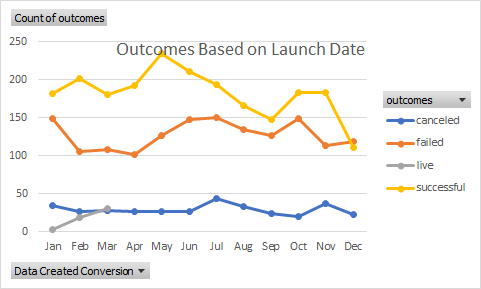

# Kickstarting with Excel

## Overview of Project

### Purpose
The purpose of this project is to assist Louise in her crowd funding campaign to help fund her play, "Fever." She is estimating a budget of over $10,000, and by analyzing current crowdfunding data from around the world, this project aims to determine whether there are specific factors that make a campaign successful or unsuccessful.
## Analysis and Challenges

### Analysis of Outcomes Based on Launch Date
As shown below, we can see that the months of April and May tend to have the highest number of successful campaigns, as compared to November and December, where there is a significant drop. It is recommended to conduct the campaign between April and May. 

### Analysis of Outcomes Based on Goals

### Challenges and Difficulties Encountered

## Results

- What are two conclusions you can draw about the Outcomes based on Launch Date?

- What can you conclude about the Outcomes based on Goals?

- What are some limitations of this dataset?

- What are some other possible tables and/or graphs that we could create?

