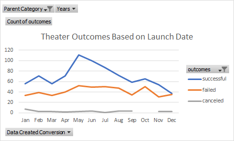
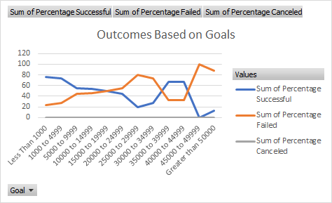

# Kickstarting with Excel

## Overview of Project

### Purpose
The purpose of this project is to assist Louise in her crowd funding campaign to help fund her play, "Fever." She is estimating a budget of over $10,000, and by analyzing current crowdfunding data from around the world, this project aims to determine whether there are specific factors that make a campaign successful or unsuccessful.
## Analysis and Challenges

### Analysis of Outcomes Based on Launch Date
As shown below, we can see that the month of May tends to have the highest number of successful campaigns, as compared to December, where there is a significant drop. Louise would also do well to be wary of fundraising between September and October, as there is a drop in successful campaigns in the former and a rise in failures in the latter.

### Analysis of Outcomes Based on Goals

The data suggests that a fundraising goal of more than $45,0000 will almost certainly result in a failed project. The data suggests that a fundraising goal of up to $10,000 is realistic. Interestingly, there is also a larger percentage of successful campaigns between $35,000 and $
40,000 - perhaps indicating a good balance between a high goal and how realistic it would be to achieve in the minds of the donors, thus leading to a succcessful campaign.

### Challenges and Difficulties Encountered
One of the main challenges with this project has been using GitHub and GitBash to upload the project, as well as the process involved with downloading the SSH key. Having never used any of these systems before, many hours were spent figuring out how it all comes together. After reserving an hour session with a tutor, an SSH key was successfully set up and all the programs thoroughly explained. 
## Results

- What are two conclusions you can draw about the Outcomes based on Launch Date?

The first conclusion is that the month of May experiences the highest amount of successful campaigns and December has the lowest amount, so Louise should campaign in May. The second conclusion is that Louise should not campaign in September or October, since September is the second largest drop in successful campaigns, and October experiences a rise in failed campaigns.

- What can you conclude about the Outcomes based on Goals?

We can conclude that fundraising goals of up to $10,000 tend to be successful, as well as those with goals between $35,000 and $40,000.
- What are some limitations of this dataset?

One of the limitations is that although we can filter by countries, we are unable to see the different regions from within those countries. The US for example is an exceptionally large country and it would be useful to have data fundraising results based on each region. It recommended to add regions for the countries in order to create another table accordingly. 

- What are some other possible tables and/or graphs that we could create?

A useful table we could create would be one based on the timeline of the campaign and of the amount of time they gave themselves as a deadline. We have the data under columns I (deadline) and J (launched_at). Based on a shorter or larger timeframe before the deaddline, there would almost certainly be a correlation between how much time they had and whether it was successful.

